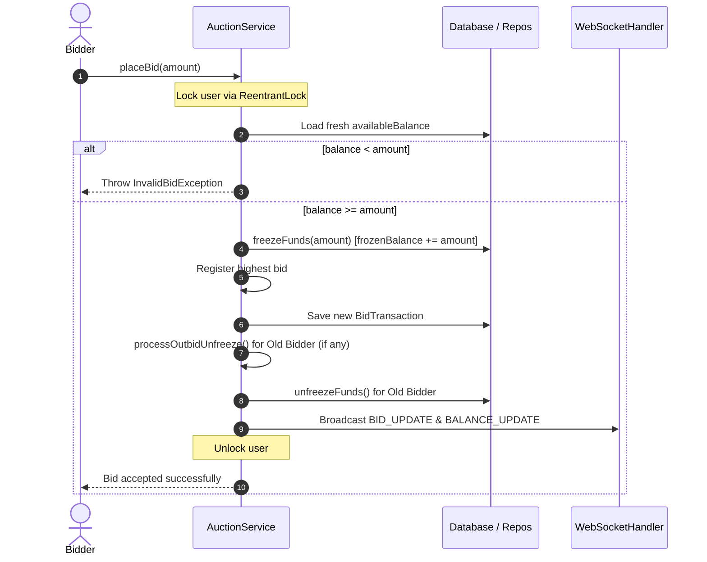

# 🚀 Pull Request: Merging `dev` into `main` (Release v1.0.0-RC)

## 📝 Overview
This Pull Request marks the graduation of our Auction Management System from active development (`dev`) to production readiness (`main`). It consolidates our core thread-safe bidding engine, proxy auto-bidding algorithms, real-time WebSocket protocol, dynamic UI components, and extensive concurrency and memory optimization fixes.

---

## 👥 Credits
*   **Khong Quang Minh**
*   **Nguyen Tuan Hung**
*   **Le Anh Tri**
*   **Nguyen Huu Nguyen**

---

## 💎 Core Features of the Application

### 1. Concurrency-Safe Bidding Engine 🔒
*   **Fund Freezing Mechanism**: When a bidder places a bid, their target funds are frozen (`availableBalance` decreases, `frozenBalance` increases). If they are outbid, the funds are instantly unfrozen and returned to their available balance. If the auction completes, the winner's account balance is formally charged.
*   **Thread-Safety Locks (`ReentrantLock`)**: Employs fine-grained `userLocks` and `auctionLocks` using a thread-safe `ConcurrentHashMap` lookup to isolate per-user balance operations. This guarantees zero race-conditions or double-charging issues even if a single user bids on multiple items at the exact same millisecond.
*   **Double-Bid Prevention**: Safely blocks consecutive bids from the same user to avoid self-outbidding.

### 2. Smart Proxy Bidding Engine (Auto-Bid) 🤖
*   **Automated Proxy Battles**: Bidders can register a maximum budget (`maxBid`) and bid increment. The engine processes active auto-bids following industry-standard proxy rules:
    *   *Single Challenger*: Jumps one increment above the highest manual bid.
    *   *Multiple Challengers*: Automatically runs a virtual bidding war, selecting the highest max budget as the winner, set to one increment above the second-highest challenger's limit (earliest timestamp wins in case of absolute ties).
*   **Safety Termination Cap**: Safe-iteration guards prevent infinite bidding war loops.
*   **Automatic Unfreezing**: Auto-deletes exhausted auto-bids and safely refunds their maximum budgets back to the available balance.

### 3. Anti-Sniping Protection (Bid Extension) ⏱️
*   If a bid is registered during the last **60 seconds** of an auction, the end time is automatically extended by **3 minutes**. This deters sniping bots, ensures fair competition, and drives optimal value for sellers.

### 4. Real-Time WebSocket Infrastructure 🌐
*   Powered by a **Javalin v6.1.3 Web Server** acting as a message broker.
*   Handles real-time client broadcasts: `BID_UPDATE`, `AUCTION_CREATED`, `AUCTION_STATUS_CHANGED`, `BALANCE_UPDATE`, and a full state `FULL_SYNC` on connection.
*   **Auto-Finish Daemon**: A backend scheduler running every **30 seconds** automatically terminates elapsed auctions, charges winners, releases collateral for active auto-bids, and pushes status updates to all open clients without requiring manual admin interaction.

### 5. Premium UI & Micro-Animations 🎨
*   **Fluid Ripple Effects**: Custom UI responses that dynamically draw mouse-triggered scaling ripples over buttons and click-targets.
*   **Animated Wave Backgrounds**: An interactive, multi-layered wave rendering system utilizing a JavaFX `Canvas` and `AnimationTimer` loop that responds natively to dark/light theme switching.
*   **Dedicated Logout Safety View**: Implements a gentle "Logging out..." spinner and a background worker delay to allow active WebSocket connections, threads, and garbage collection tasks to finish gracefully prior to detaching active windows.

---

## 🛠️ Summary of Changes Added in this Release (Changelog)

We have addressed crucial edge cases, visual inconsistencies, and memory/thread states:

```diff
+ ADDED: Anti-Sniping triggers extending final minutes by +3m.
+ ADDED: Smooth canvas wave backgrounds for UI screens.
+ ADDED: Dedicated Logout screen giving GC and WS handlers a safe 900ms cleanup window.
+ ADDED: Image Cache (ImageLoaderUtil) resolving heavy Catbox Cloud loading lags.
+ FIXED: Auto-bidding status disappearing from the UI upon user relog.
+ FIXED: Auto-bid loop condition causing UI image assets to drop after splash screens.
+ FIXED: Incorrect frozen balance calculations during sequential manual outbids.
+ IMPROVED: Redesigned VBox structures for Login and Registration layouts.
```

---

## 📐 Architecture Diagrams

### 🔄 Thread-Safe Fund Freezing Workflow



---

## 🚀 How to Run & Verify

### Headless WebSocket & REST Server
To start the backend server from source code (SQLite/PostgreSQL):
```bash
mvn exec:java -Pserver -Dcheckstyle.skip=true
```

### Desktop JavaFX Client
To run the rich graphical user interface client application:
```bash
mvn clean javafx:run
```

---

## 📋 Reviewer Checklists
- [ ] **Functional WebSocket Tests**: Verify that bidding on client A instantly updates the highest bid and balances on client B.
- [ ] **Thread Locking Integrity**: Run mock concurrent parallel bidding simulations to verify that balances never duplicate or conflict.
- [ ] **Auto-Bid Resolution**: Ensure that multiple users registering auto-bids resolves to the correct winner and correctly releases funds for losers.
- [ ] **UI Scaling**: Review the new registration VBox layout dimensions under multiple resolutions.
