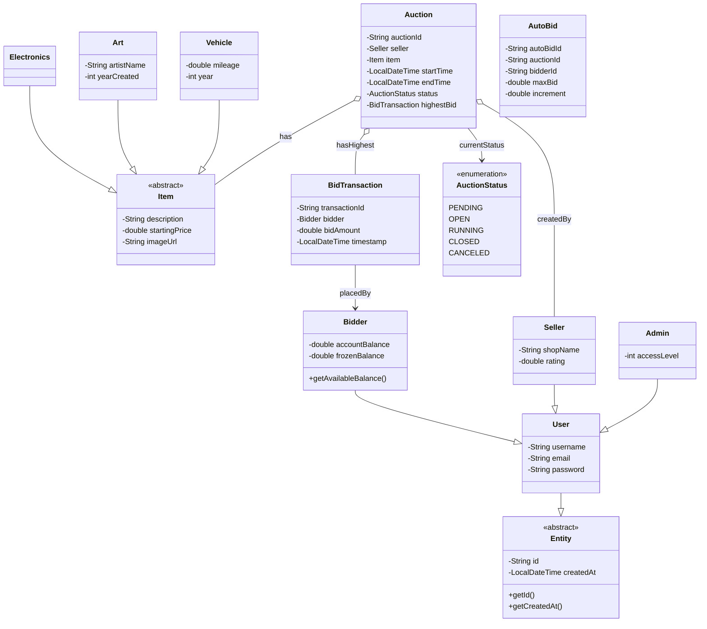
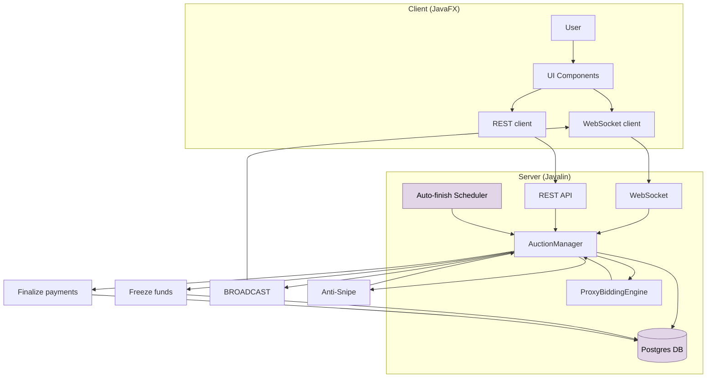

# 🏛️ Nền Tảng Đấu Giá Thời Gian Thực Phân Tán (BTLN4)
### *Tài Liệu Tổng Hợp Kiến Trúc Phần Mềm & Mô Tả Hệ Thống*

---

## 📖 Tổng Quan

**BTLN4** là một nền tảng quản lý đấu giá thời gian thực, hiệu năng cao và phân tán. Ứng dụng được chia thành một microservice backend nhẹ sử dụng giao thức truyền thông dựa trên WebSocket và REST APIs, cùng một ứng dụng desktop JavaFX hiện đại, chất lượng cao theo mô hình MVC.

Các mục tiêu thiết kế chính của hệ thống bao gồm:
*   **An Toàn Đồng Thời Tuyệt Đối**: Giải quyết các xung đột đặt giá và điều chỉnh số dư đa luồng một cách liền mạch, không xảy ra tình trạng race condition.
*   **Dịch Vụ Tự Động & Ủy Quyền (Proxy Bidding)**: Lập lịch nền tự động quản lý vòng đời phiên đấu giá và động cơ tự động đặt giá (auto-bid).
*   **Kiến Trúc Chuẩn Design Pattern**: Áp dụng triệt để các mẫu thiết kế phần mềm (MVC, Factory, Facade, Observer) giúp mã nguồn dễ dàng mở rộng và bảo trì.
*   **Trải Nghiệm Người Dùng (UX/UI) Đỉnh Cao**: Giao diện JavaFX linh hoạt, hỗ trợ chế độ sáng/tối, tích hợp hiệu ứng gợn sóng (ripple) và biểu đồ đấu giá trực quan.

---

## 🛠️ Ngăn Xếp Công Nghệ

| Thành Phần | Công Nghệ | Phiên Bản / Tính Năng |
| :--- | :--- | :--- |
| **Môi Trường Runtime** | Java SE | Phiên bản 17+ (Tối ưu cho JDK 21) |
| **Framework Backend** | Javalin | v6.1.3 (REST Endpoints & WebSockets An Toàn Luồng) |
| **Bộ Công Cụ UI Desktop** | JavaFX / FXML | Tách biệt giao diện (Controller/FXML), hỗ trợ Biểu đồ & Canvas |
| **Thành Phần UI & Biểu Tượng** | ControlsFX / Ikonli | Đồ họa vector, điều khiển nâng cao cho JavaFX |
| **Quản Lý Kết Nối & DB** | JDBC / HikariCP / PostgreSQL | Data Access Object (DAO) với Connection Pooling siêu tốc |
| **Tuần Tự Hóa & Bảo Mật** | Gson / Argon2 | Tuần tự hóa JSON payload WebSockets, băm mật khẩu bằng Argon2id |
| **Quản Lý Lưu Trữ Ảnh** | Catbox API | Upload ảnh lên Cloud ẩn danh qua `CatboxUploader` |
| **Build & CI/CD** | Apache Maven / Actions | Cấu hình build tự động, quản lý dependencies (`pom.xml`) |

---

## 📦 Cấu Trúc Dự Án & Design Patterns

Hệ thống tuân thủ chặt chẽ nguyên lý S.O.L.I.D và chia thành các package rõ ràng:

```text
BTLN4/src/main/java/com/auction/
├── client/         # Client WebSocket & HTTP gọi API lên Server (ApiClient, AuctionClient)
├── controller/     # Tầng điều khiển giao diện (Login, Dashboard, LiveBidding, Admin, v.v.)
├── exception/      # Lỗi nghiệp vụ tùy chỉnh (InvalidBidException, InvalidStatusException)
├── factory/        # [Factory Pattern] Tạo Item: ArtFactory, ElectronicsFactory, VehicleFactory
├── manager/        # Quản lý trung tâm cho Đấu giá (AuctionManager)
├── model/          # [Observer Pattern] Entities (User, Bidder, Item, Auction, AutoBid, v.v.)
├── repository/     # Lớp truy xuất dữ liệu (JdbcUserRepository, JdbcAuctionRepository, v.v.)
├── security/       # Dịch vụ bảo mật mật khẩu (PasswordHashService)
├── server/         # Khởi tạo Server, WebSocket Handler & REST API (Javalin)
├── service/        # [Facade Pattern] Logic lõi: AppFacade, ProxyBiddingEngine, UserService
└── util/           # Tiện ích: SessionManager, NavigationManager, AnimationUtil, CatboxUploader...
```

### Các Mẫu Thiết Kế (Design Patterns) Nổi Bật:
*   **MVC (Model-View-Controller)**: Toàn bộ ứng dụng JavaFX được chia tách Model (`com.auction.model`), View (`.fxml` và `main.css`), và Controller (`com.auction.controller`).
*   **Factory Method**: Package `com.auction.factory` giúp khởi tạo các loại sản phẩm khác nhau (`Art`, `Electronics`, `Vehicle`) từ giao diện `ItemFactory`.
*   **Facade**: `AppFacade` (trong `service`) cung cấp một giao diện thống nhất cấp cao giúp các Controller dễ dàng tương tác với các hệ thống con phức tạp.
*   **Observer**: Được triển khai trong Model (`Subject`, `Observer`) để các thực thể UI tự động phản hồi lại khi có thay đổi trạng thái đấu giá hoặc giá thầu.
*   **Singleton**: Áp dụng trong cấu hình kết nối DB (`DatabaseConnection`) và quản lý bộ nhớ đệm (`CacheManager`, `SessionManager`).

---

## 💎 Tính Năng Cốt Lõi

### 1. Hệ Thống Đặt Giá Thời Gian Thực & Cơ Chế Đóng Băng Tài Khoản 🔒
Giải quyết tính toàn vẹn tài chính trong môi trường đa luồng qua cơ chế **Đóng Băng Quỹ (Fund Freezing)** tại `AuctionService` & `BiddingService`:
*   **Luồng Phân Bổ Quỹ**:
    1. Người dùng đặt giá, hệ thống kiểm tra `availableBalance` qua `JdbcUserRepository`.
    2. Nếu hợp lệ, tiền chuyển từ `availableBalance` sang `frozenBalance`.
    3. **Hoàn Trả Khi Bị Vượt Giá (Outbid)**: Nếu người dùng khác vượt giá, số tiền đang bị đóng băng của người cũ được tự động hoàn lại (`unfreezeFunds`) theo thời gian thực.
*   **An Toàn Đa Luồng**: Sử dụng `ReentrantLock` (khóa đồng thời) cho mỗi `userId` khi xử lý giao dịch.

### 2. Engine Ủy Quyền Đặt Giá (Proxy Bidding / Auto-Bid) 🤖
Do `ProxyBiddingEngine` và `JdbcAutoBidRepository` đảm nhiệm, cho phép người dùng cấu hình giá tối đa (`maxBid`) và bước giá:
*   Hệ thống tự động thay mặt người dùng đua giá nếu có người chơi khác tham gia, luôn duy trì giá thấp nhất có thể để chiến thắng.
*   Tự động phát hiện và giải quyết xung đột khi có nhiều Auto-Bids trong cùng một phiên.

### 3. Bảo Vệ Chống Snipe (Anti-Snipe / Thời Gian Vàng) ⏱️
Chống lại các bot "bắn tỉa" giây cuối bằng cách tự động gia hạn thời gian (`endTime`):
*   Tính năng tích hợp trong `AuctionManager`: Nếu một giá hợp lệ được đặt trong vòng **60 giây** cuối, thời gian kết thúc tự động cộng thêm **3 phút**, đảm bảo tính công bằng tuyệt đối.

### 4. Truyền Thông Dữ Liệu Thời Gian Thực & API 🌐
Sử dụng `AuctionWebSocketHandler` và `RestApiHandler` trên Javalin:
*   **WebSocket Payload (Client <-> Server)**: Các lệnh `PLACE_BID`, `REGISTER_AUTO_BID`, `BID_UPDATE`, `BALANCE_UPDATE` tuần tự hóa bằng Gson (`AuctionSerializer`).
*   Khả năng cập nhật biểu đồ lịch sử đấu giá realtime (`AuctionChartHelper`) trên giao diện.

### 5. Tối Ưu Hiệu Năng: Caching & Tiện Ích ⚡
*   **Cache RAM**: `CacheManager` & `HotItemCache` lưu trữ nhanh danh sách phiên đấu giá hiện hành, giảm tải truy xuất DB (PostgreSQL).
*   **Image Caching**: `ImageLoaderUtil` tải ảnh bất đồng bộ từ Cloud về local cache, ngăn UI thread bị "đóng băng".
*   **Đồng Bộ Thời Gian**: `TimeSyncManager` đồng bộ chuẩn xác đồng hồ Client với Server.

### 6. Trải Nghiệm Giao Diện Người Dùng (UI/UX) Cao Cấp 🎨
*   **Quản Lý Điều Hướng Chuyên Nghiệp**: `NavigationManager` điều phối chuyển đổi FXML.
*   **Hiệu Ứng Nền Mượt Mà**: `AnimationUtil` vẽ các làn sóng Canvas uyển chuyển.
*   **Thống Kê Trực Quan**: Biểu đồ đường thời gian thực (`AuctionChartHelper`) minh họa lịch sử giá.
*   **Quản Lý Đăng Xuất & Bộ Nhớ**: Độ trễ ngắt kết nối an toàn giải phóng tài nguyên mạng, ngăn memory leak rò rỉ bộ nhớ.

### 7. Bảo Mật Tối Đa Với Thuật Toán Argon2id 🛡️
Hệ thống sử dụng thuật toán băm mật khẩu **Argon2id** thông qua `PasswordHashService` để bảo vệ tài khoản:
*   **Chống Tấn Công Brute-Force & Rainbow Tables**: Tự động sinh ngẫu nhiên Salt (muối) cho mỗi tài khoản.
*   **Kháng Tấn Công Bằng GPU/ASIC**: Cấu hình yêu cầu bộ nhớ cao (memory-hard) và chi phí tính toán của Argon2id làm cho việc bẻ khóa hàng loạt trở nên bất khả thi.

---

## 🗄️ Sơ Đồ Lớp & Luồng Hệ Thống

### 1. Sơ Đồ Lớp (Class Diagram)


### 2. Cấu Trúc Thành Phần (Flowchart)


---

## 🚀 Hướng Dẫn Demo Nhanh (Quick Demo)

Mục tiêu của phần demo này là minh họa vòng đời của một phiên đấu giá hoàn chỉnh: từ bước khởi chạy client, tạo phiên, đặt giá trực tiếp (Manual Bid), cho đến khi kích hoạt các tính năng nâng cao như Ủy quyền đặt giá (Auto-Bid) và Chống bắn tỉa (Anti-Snipe).

Do máy chủ backend đã được triển khai và vận hành liên tục trên Render (`https://btln4.onrender.com`), bạn **không cần phải khởi động server cục bộ**. Toàn bộ trải nghiệm sẽ diễn ra liền mạch thông qua ứng dụng khách (Client) kết nối trực tiếp đến đám mây.

### 📊 Luồng Giao Tiếp Thời Gian Thực (Sequence Diagram Chuyên Sâu)
Sơ đồ dưới đây mô tả cách hệ thống xử lý An toàn đa luồng, Chống bắn tỉa, và Động cơ Auto-Bid theo thời gian thực:

```mermaid
sequenceDiagram
    autonumber
    actor U1 as Người Dùng A - Thủ công
    actor U2 as Người Dùng B - AutoBid
    participant C as JavaFX Client
    participant API as Javalin Server
    participant Srv as Auction Service
    participant DB as Postgres DB

    Note over U1,DB: Giai đoạn 1: Khởi tạo & Đồng bộ
    U1->>C: Đăng nhập & Vào phòng Live Bidding
    C->>API: POST /api/auth/login
    API-->>C: Trả về Token/Session
    C->>API: Thiết lập WebSocket wss://btln4.onrender.com/auction
    API-->>C: WS session established
    C->>API: REQUEST_SYNC
    API->>Srv: Lấy trạng thái phòng đấu giá
    Srv->>API: Trả về trạng thái phòng
    API-->>C: FULL_SYNC (history & config)

    Note over U1,DB: Giai đoạn 2: Đặt giá & Xử lý an toàn đa luồng
    U1->>C: Nhập 150 và bấm Đặt Giá
    C->>API: PLACE_BID (150)
    API->>Srv: placeBid request

    rect rgb(20, 30, 45)
        Note over Srv,DB: Concurrency Control (Locking)
        Srv->>Srv: acquire lock for bidder A
        Srv->>DB: SELECT availableBalance FOR UPDATE
        DB-->>Srv: availableBalance ok
        Srv->>DB: update balances: available -= 150
        Srv->>DB: update balances: frozen += 150
        Srv->>Srv: persist BidTransaction
        Srv->>Srv: release lock
    end

    Srv->>Srv: check anti-snipe
    alt if <60s remaining
        Srv->>DB: extend endTime +3m
        Srv->>API: Notify Auction Status Changed
        API-->>C: AUCTION_STATUS_CHANGED
    end

    Srv->>API: Notify Bid & Balance Updates
    API-->>C: BID_UPDATE (highest: U1 - 150)
    API-->>C: BALANCE_UPDATE (U1)

    Note over U1,DB: Giai đoạn 3: Auto-bid reacts
    Srv->>Srv: run ProxyBiddingEngine
    Srv->>DB: query auto-bids for auction
    DB-->>Srv: found U2 (max:500, inc:10)
    Srv->>Srv: compute new bid = 160

    rect rgb(35, 20, 45)
        Note over Srv,DB: Auto-bid Balance Adjustment
        Srv->>Srv: acquire locks for A and B
        Srv->>DB: unfreeze A (available += 150)
        Srv->>DB: unfreeze A (frozen -= 150)
        Srv->>DB: freeze B (available -= 160)
        Srv->>DB: freeze B (frozen += 160)
        Srv->>DB: persist BidTransaction for B
        Srv->>Srv: release locks
    end

    Srv-->>API: auto-bid applied
    API-->>C: AUTO_BID_LOG
    API-->>C: BID_UPDATE (highest: U2 - 160)
    API-->>C: BALANCE_UPDATE (U1,U2)

    C-->>U1: UI updates (chart, balance)
    C-->>U2: UI notification (auto-bid)
```



### 🛠️ Các Bước Thực Hiện Demo

#### Bước 1: Khởi Chạy Ứng Dụng Khách (JavaFX Client)
Chỉ cần mở Terminal tại thư mục gốc của dự án và chạy lệnh Maven. Client đã được cấu hình mặc định để tự động trỏ tới máy chủ đám mây.
```bash
mvn clean javafx:run
```

#### Bước 2: Chuẩn Bị Tài Khoản & Tạo Phiên
Trên giao diện UI, tạo (hoặc đăng nhập) 2 tài khoản riêng biệt để đóng vai trò **Người bán (Seller)** và **Người mua (Bidder)**.
Người bán tiến hành tạo một phiên đấu giá mới thông qua giao diện hoặc qua REST API.

Ví dụ tạo nhanh phiên đấu giá qua REST API bằng cURL:
```bash
curl -X POST [https://btln4.onrender.com/api/auctions](https://btln4.onrender.com/api/auctions) \
  -H "Content-Type: application/json" \
  -d '{
        "sellerId": "seller-1",
        "itemName": "Bức Tranh Mona Lisa (Bản sao)",
        "startPrice": 100.0,
        "endTime": "2026-05-25T21:00:00"
      }'
```

#### Bước 3: Tương Tác & Quan Sát Thời Gian Thực (WebSocket)
Khi Người mua truy cập vào phòng đấu giá trực tiếp (Live Bidding), hệ thống WebSocket sẽ lập tức kích hoạt luồng truyền tải dữ liệu hai chiều.

Bạn có thể quan sát Payload thiết lập tự động hóa được gửi ngầm giữa Client và Server (thông qua endpoint `ws://btln4.onrender.com/auction`):

**Thiết lập Auto-Bid (Ủy quyền đặt giá tự động):**
```json
{
  "type": "REGISTER_AUTO_BID",
  "auctionId": "AUCTION_ID",
  "bidderId": "BIDDER_ID",
  "maxBid": 500.0,
  "increment": 10.0
}
```

### 👁️ Những Điểm Cơ Chế Cốt Lõi Cần Chú Ý Khi Demo:
Thay vì đặt giá thủ công, hãy quan sát cách hệ thống tự động xử lý các tình huống phức tạp theo thời gian thực:

1.  **Phản Ứng Của Engine Auto-Bid:**
    Nếu tài khoản B đã thiết lập Auto-Bid với cấu hình như trên, ngay khi có một người chơi khác (tài khoản A) đặt giá, hệ thống sẽ lập tức thay mặt tài khoản B trả giá cao hơn (bằng mức giá của A cộng thêm `increment`). Quá trình "đua giá" này diễn ra ngầm trong tích tắc, đồng thời Server sẽ đẩy thông báo `AUTO_BID_LOG` lên màn hình.
2.  **Hoàn Tiền Tức Thời (Fund Unfreezing):**
    Ngay khi tài khoản A bị Auto-Bid của tài khoản B vượt mặt (Outbid), cơ chế hoàn tiền sẽ được kích hoạt tức thì. Bạn hãy nhìn vào góc màn hình của tài khoản A: số tiền vừa bị đóng băng sẽ lập tức nhảy ngược trở lại ví khả dụng mà hoàn toàn không cần tải lại trang.
3.  **Kích Hoạt Chống Bắn Tỉa (Anti-Snipe):**
    Để kiểm chứng tính công bằng của nền tảng, hãy thử kích hoạt bước giá (hoặc để Auto-Bid tự chạy) khi đồng hồ đếm ngược chỉ còn dưới **60 giây**. Bạn sẽ thấy hệ thống tự động cộng thêm **3 phút** vào tổng thời gian kết thúc, ngăn chặn triệt để hành vi dùng bot chốt giá vào những giây cuối cùng.

---

## ⚙️ Hướng Dẫn Vận Hành Hệ Thống (Mã Nguồn Khách)

### Yêu Cầu Môi Trường
*   **Java Development Kit (JDK)**: Phiên bản 17 trở lên (Khuyến nghị JDK 21).
*   **Apache Maven**: Phiên bản 3.8.x hoặc mới hơn.

### Các Lệnh Thực Thi (Maven)

#### 1. Khởi Động Ứng Dụng Khách (Desktop UI)
Do không cần khởi chạy máy chủ cục bộ, bạn có thể chạy trực tiếp ứng dụng khách để kết nối với máy chủ đám mây bằng lệnh sau:
```bash
mvn clean javafx:run
```

#### 2. Build & Đóng Gói (Production)
Biên dịch dự án và tạo file thực thi JAR:
```bash
mvn clean package
```
