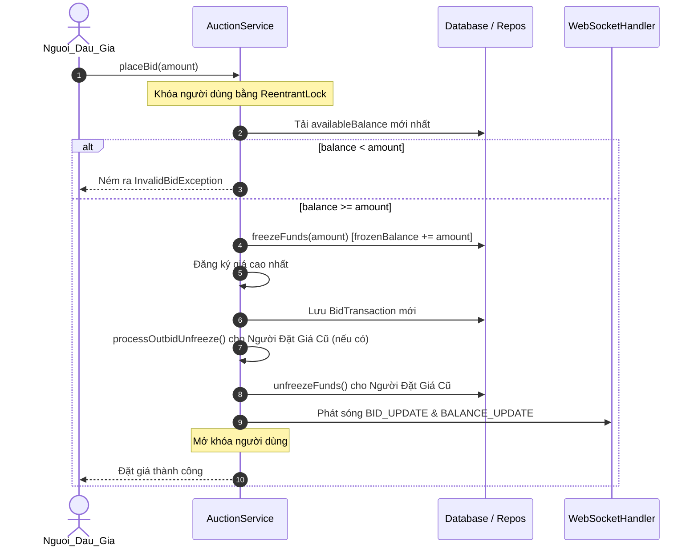
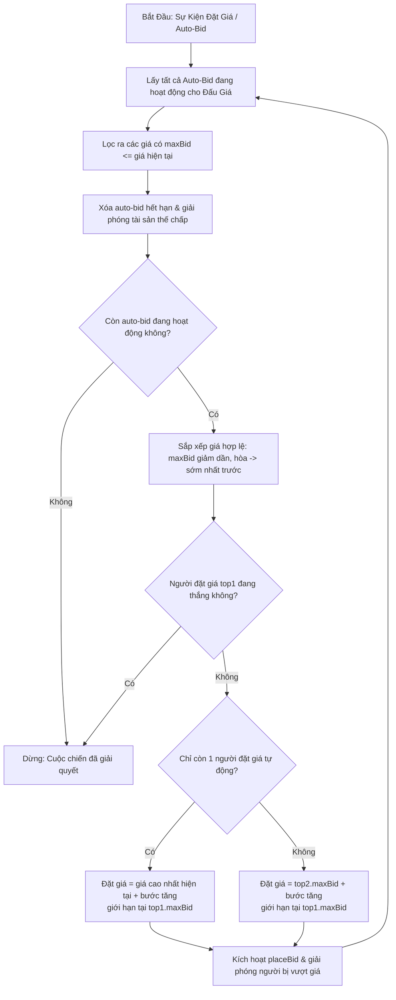
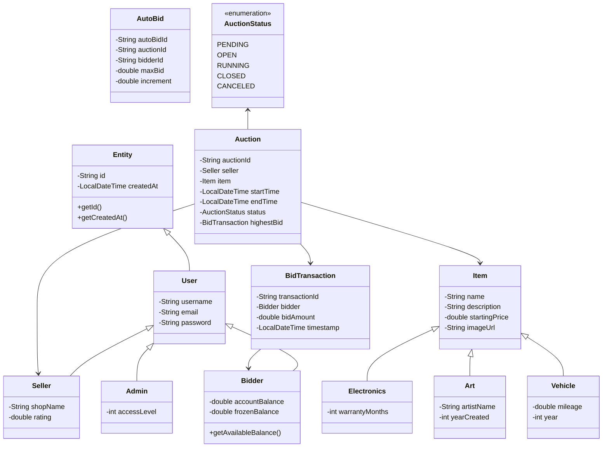

# 🏛️ Nền Tảng Đấu Giá Thời Gian Thực Phân Tán (BTLN4)
### *Tài Liệu Tổng Hợp Kiến Trúc Phần Mềm & Mô Tả Hệ Thống*

---

## 📖 Tổng Quan

**BTLN4** là một nền tảng quản lý đấu giá thời gian thực, hiệu năng cao, phân tán. Ứng dụng được chia thành một microservice backend nhẹ, không giao diện (headless) sử dụng giao thức truyền thông dựa trên WebSocket, và một ứng dụng desktop JavaFX hiện đại, chất lượng cao.

Các mục tiêu thiết kế chính của hệ thống bao gồm:
*   **An Toàn Đồng Thời Tuyệt Đối**: Giải quyết các xung đột đặt giá và điều chỉnh số dư đa luồng một cách liền mạch, không xảy ra race condition.
*   **Dịch Vụ Tự Ổn Định**: Lập lịch nền tự động để đóng, tính toán và xử lý các phiên đấu giá mà không cần can thiệp quản trị.
*   **Trải Nghiệm Người Dùng Tương Tác Cao Cấp**: Giao diện tự thích ứng chế độ sáng/tối, hiệu ứng gợn sóng khi nhấp chuột, và nền sóng chuyển động đa lớp.

---

## 🛠️ Ngăn Xếp Công Nghệ

| Thành Phần | Công Nghệ | Phiên Bản / Tính Năng |
| :--- | :--- | :--- |
| **Môi Trường Runtime** | Java SE | Phiên bản 17+ (Tối ưu cho JDK 21) |
| **Framework Backend** | Javalin | v6.1.3 (REST Endpoints & WebSockets An Toàn Luồng) |
| **Bộ Công Cụ UI Desktop** | JavaFX / FXML | v21 (CSS tùy chỉnh đầy đủ, VBox/StackPane linh hoạt) |
| **Thành Phần UI & Biểu Tượng** | ControlsFX / Ikonli | Đồ họa vector, form xác thực, điều khiển tùy chỉnh |
| **Chủ Đề / Thiết Kế** | BootstrapFX / Tùy Chỉnh | Hệ thống màu HSL tùy chỉnh hài hòa & chế độ động |
| **Quản Lý Kết Nối** | HikariCP | v5.1.0 (Tái sử dụng kết nối cơ sở dữ liệu hiệu năng cao) |
| **Cơ Sở Dữ Liệu Chính** | SQLite & PostgreSQL | Tải driver cơ sở dữ liệu đa cấu hình |
| **Tuần Tự Hóa** | Google Gson | Tuần tự hóa JSON của thực thể, giá thầu và WebSocket payload |
| **Build & CI/CD** | Apache Maven / Actions | Cấu hình build tự động, checkstyle và deploy cloud |

---

## 📦 Cấu Trúc Dự Án

```text
BTLN4/
├── .github/workflows/          # CI/CD pipelines
│   ├── maven.yml               # Tự động compile, checkstyle và chạy kiểm thử (JDK 21)
│   └── render_deploy.yml       # Tự động deploy server lên môi trường Render Cloud
└── BTLN4/                      # Thư mục mã nguồn chính
    ├── src/main/java/com/auction/
    │   ├── client/             # Triển khai client WebSocket và REST
    │   ├── controller/         # Tầng controller MVC FXML (Dashboard, Login, Profile, v.v.)
    │   ├── exception/          # Exception nghiệp vụ chuyên biệt (InvalidBid, InvalidStatus)
    │   ├── factory/            # Triển khai Factory Pattern cho phân loại mặt hàng
    │   ├── manager/            # Bộ điều khiển dịch vụ và giao dịch cấp cao
    │   ├── model/              # Thực thể nghiệp vụ (User, Bidder, Seller, Item, Auction, Bids)
    │   ├── repository/         # Data Access Objects JDBC tích hợp HikariCP
    │   ├── server/             # Server chính Javalin và broker kết nối WebSocket
    │   ├── service/            # Logic nghiệp vụ cốt lõi (Bidding Engine, Proxy Bidding Engine)
    │   └── util/               # Lớp tiện ích (Animations, Database, Caches, Catbox uploaders)
    ├── src/main/resources/     # FXML stylesheet, layout map và tài nguyên giao diện
    ├── pom.xml                 # Maven build dependencies và execution profiles
    └── README.md               # Hướng dẫn thiết lập dự án dành cho người dùng
```

---

## 💎 Tính Năng Cốt Lõi

### 1. Engine Đặt Giá An Toàn Đồng Thời với Cơ Chế Đóng Băng Tài Khoản 🔒
Để duy trì tính nhất quán tài chính mà không cần khóa bảng nặng trên PostgreSQL hoặc SQLite, hệ thống vận hành theo cơ chế **Đóng Băng Tài Khoản** tiên tiến:

*   **Luồng Phân Bổ Quỹ**:
    1.  **Đặt Giá**: Khi người dùng `A` đặt giá `10,000,000 ₫`, `availableBalance` của họ được xác minh. Nếu đủ, hệ thống chuyển ngay số tiền từ `availableBalance` sang `frozenBalance`.
    2.  **Hoàn Trả Khi Bị Vượt Giá**: Nếu người dùng `B` vượt giá người dùng `A` lên `11,000,000 ₫`, hệ thống tự động kích hoạt `unfreezeFunds()` cho người dùng `A`, hoàn trả `10,000,000 ₫` về `availableBalance` trước khi đóng băng quỹ của người dùng `B`.
    3.  **Kết Thúc Đấu Giá**: Khi phiên đấu giá kết thúc, tài khoản người thắng bị trừ: số tiền đóng băng được khấu trừ vĩnh viễn từ cả `totalBalance` lẫn `frozenBalance` cùng lúc.
*   **An Toàn Đa Luồng**:
    *   `userLocks`: Một `ConcurrentHashMap` gồm các instance `ReentrantLock` đảm bảo rằng nếu một người dùng đặt giá trên nhiều mặt hàng cùng một lúc, các thao tác luồng của họ được thực thi tuần tự, tránh race condition.
    *   `Ngăn chặn đặt giá trùng lặp`: Xác thực rằng người dùng không thể đặt giá liên tiếp hai lần nếu họ đang giữ giá cao nhất.



---

### 2. Engine Đấu Giá Tự Động Theo Tiêu Chuẩn Ngành (Auto-Bid) 🤖
**Engine Đấu Giá Tự Động** cho phép người dùng xác định ngưỡng ngân sách tối đa (`maxBid`) và bước tăng giá. Các xung đột đặt giá được giải quyết tự động theo quy tắc tiêu chuẩn ngành:



---

### 3. Bảo Vệ Chống Snipe (Gia Hạn Thời Gian Đặt Giá) ⏱️
Để ngăn các bot snipe đấu giá đánh cắp mặt hàng trong những giây cuối cùng của phiên đấu giá:
*   Mỗi giá đặt vào đều được tính thời gian so với `endTime` của phiên đấu giá.
*   Nếu giá được đặt trong vòng **60 giây** cuối cùng, hệ thống tự động gia hạn `endTime` thêm **3 phút**.
*   Gia hạn này được ghi vào cơ sở dữ liệu và phát sóng tới tất cả các client đang kết nối ngay lập tức.

---

### 4. Hệ Thống Sự Kiện Thời Gian Thực & WebSocket 🌐
Client và server giao tiếp thông qua giao thức nhắn tin JSON có cấu trúc qua Java WebSockets:

#### Payload Client $\rightarrow$ Server
*   `PLACE_BID`: Gửi thông tin xác thực người đặt giá và số tiền đặt giá.
*   `REGISTER_AUTO_BID`: Gửi cấu hình đặt giá tự động (giá tối đa, bước tăng giá).
*   `CREATE_AUCTION`: Gửi metadata mặt hàng, giá khởi điểm, hình ảnh và thông tin danh mục.
*   `ADMIN_ACTION`: Gửi sự kiện vòng đời quản trị (`approve`, `start`, `finish`, `cancel`).
*   `REQUEST_SYNC`: Yêu cầu đồng bộ hóa cơ sở dữ liệu đầy đủ khi khởi động.

#### Phát Sóng Server $\rightarrow$ Client
*   `BID_UPDATE`: Phát sóng giá thầu mới để cập nhật đồ thị, biểu đồ và danh sách.
*   `AUCTION_CREATED`: Hiển thị ngay lập tức các mặt hàng mới chờ duyệt tới quản trị viên và người dùng.
*   `AUCTION_STATUS_CHANGED`: Cập nhật trực tiếp các trạng thái (`OPEN`, `RUNNING`, `CLOSED`, `CANCELED`).
*   `BALANCE_UPDATE`: Nhắm tới phiên cụ thể của người bị vượt giá hoặc người thắng cuộc để điều chỉnh số dư khả dụng theo thời gian thực.
*   `FULL_SYNC`: Phát sóng ảnh chụp nhanh tất cả các phiên đấu giá đang hoạt động và đã kết thúc.

---

### 5. Hệ Thống Cache Hiệu Năng Cao ⚡
*   **Cache Hình Ảnh (`ImageLoaderUtil`)**: Để giải quyết vấn đề render UI chậm do độ trễ lưu trữ hình ảnh đám mây (Catbox), hình ảnh được tải xuống bất đồng bộ và lưu cache cục bộ.
*   **Cache Mặt Hàng Hot (`HotItemCache` / `auctionCache`)**: Các trạng thái đấu giá và nhật ký đặt giá được cập nhật thường xuyên được duy trì trong cache in-memory an toàn luồng, giảm thiểu số lần đọc/ghi cơ sở dữ liệu của các phiên đang hoạt động.

---

### 6. Giao Diện Premium, Hoạt Ảnh & Quản Lý Bộ Nhớ 🎨
*   **Hiệu Ứng Gợn Sóng Chuột**: Render các vòng tròn overlay mềm mại khi nhấp chuột trên UI, tạo phản hồi thị giác hữu cơ, cao cấp.
*   **Hoạt Ảnh Sóng Canvas**: Sử dụng canvas buffer JavaFX kết hợp với `AnimationTimer` để chạy các overlay sóng tùy chỉnh, phù hợp hoàn hảo với cả chế độ sáng và tối.
*   **Bộ Xử Lý Vòng Đời Đăng Xuất**: Chuyển đổi giao diện ngay lập tức có thể gây rò rỉ bộ nhớ do các kết nối socket hoặc vòng lặp render còn đang hoạt động. Hệ thống chuyển hướng tới **Màn Hình Đăng Xuất** tùy chỉnh, kích hoạt **độ trễ 900ms** an toàn, cho phép các WebSocket handler, luồng nền và cơ chế garbage collection tắt an toàn.

---

## 🗄️ Sơ Đồ Lớp Mô Hình Nghiệp Vụ



---

## 🚀 Hướng Dẫn Cài Đặt & Vận Hành

### Yêu Cầu Hệ Thống
*   Java Development Kit (JDK) **17** hoặc **21**
*   Maven v3.8+

### Lệnh Cài Đặt & Chạy

#### 1. Khởi Động Server (Headless)
Chạy server headless khởi tạo broker REST và WebSockets trên cổng `7000`:
```bash
mvn exec:java -Pserver -Dcheckstyle.skip=true
```

#### 2. Khởi Động Giao Diện Desktop
Khởi chạy giao diện dashboard JavaFX tương tác đầy đủ:
```bash
mvn clean javafx:run
```

#### 3. Build Production
Để biên dịch hệ thống thành các file JAR thực thi production shaded:
```bash
mvn clean package
```
